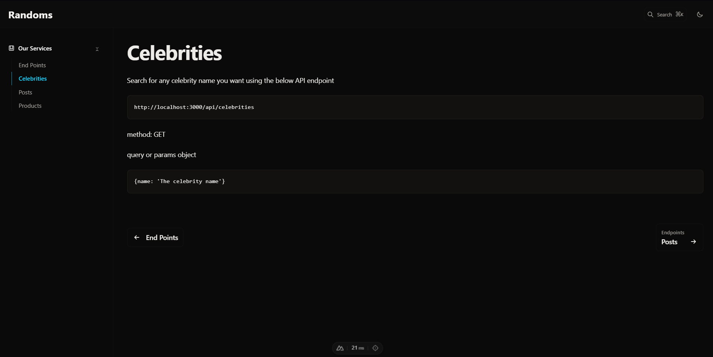

<h1>Randoms</h1>

  Randoms to aplikacja internetowa stworzona w <strong>Nuxt.js</strong>, która umożliwia użytkownikom interakcję z różnymi API w celu wykonywania operacji, takich jak pobieranie informacji, dodawanie, aktualizowanie czy usuwanie danych. Projekt służy jako praktyczny przykład wykorzystania dynamicznych plików w Nuxt.js i interakcji z API.

<h2>Hostowanie:</h2>

  Aplikacja <strong>Randoms</strong> jest hostowana na platformie <strong>Netlify</strong> i jest dostępna pod następującym adresem: 
  <a href="https://random-api-app.netlify.app" target="_blank">https://random-api-app.netlify.app</a>. 
  Każdy, kto posiada ten link, może odwiedzić aplikację i przetestować jej funkcjonalności.

<h2>Obraz poglądowy:</h2>

  

<h2>Funkcjonalności:</h2>
<ul>
  <li>
    <strong>API Ninja:</strong> Pobieranie informacji o celebrytach na podstawie podanego imienia. Do korzystania z tego API wymagany jest klucz API, który należy umieścić w pliku <code>.env</code>.
  </li>
  <li>
    <strong>JSONPlaceholder:</strong> Obsługuje operacje związane z postami:
    <ul>
      <li>Pobieranie postów</li>
      <li>Dodawanie nowych postów</li>
      <li>Aktualizowanie istniejących postów</li>
      <li>Usuwanie postów</li>
    </ul>
  </li>
  <li>
    <strong>Fake Store API:</strong> Pobieranie danych o produktach oraz dodawanie nowych produktów.
  </li>
</ul>

<h2>Dynamiczne pliki:</h2>

  Aplikacja wykorzystuje dynamiczne pliki w <strong>Nuxt.js</strong>, co umożliwia użytkownikom wprowadzanie parametrów bezpośrednio w adresie URL (np. ID posta, nazwę celebryty czy produkt). Dzięki temu aplikacja jest bardziej interaktywna i elastyczna.

<h2>Wymagania:</h2>
<ul>
  <li>
    Klucz API do <strong>API Ninja</strong>:
    <ul>
      <li>Utwórz konto na <a href="https://api-ninjas.com" target="_blank">API Ninja</a> i pobierz klucz API.</li>
      <li>Umieść klucz w pliku <code>.env</code> w następującym formacie:
        <pre><code>apiNinjaKey=TWÓJ_KLUCZ_API</code></pre>
      </li>
    </ul>
  </li>
</ul>

<h2>Technologie:</h2>
<ul>
  <li>Nuxt.js</li>
  <li>Tailwind CSS</li>
</ul>

<h2>Jak uruchomić projekt?</h2>
<pre><code>
# Sklonuj repozytorium
git clone https://github.com/twoje-repo/randoms.git

# Przejdź do folderu projektu
cd randoms

# Zainstaluj zależności
npm install

# Uruchom aplikację w trybie deweloperskim
npm run dev
</code></pre>

<h2>Podsumowanie:</h2>

  Randoms to świetny przykład aplikacji, która łączy dynamiczność Nuxt.js z obsługą API, pozwalając użytkownikom na szybkie wykonywanie zapytań i operacji CRUD. Idealny projekt do nauki i eksperymentów z różnymi API!

<strong>Autor:</strong> Projekt został wykonany przez Maikel jako część kursu Nuxt.js.

